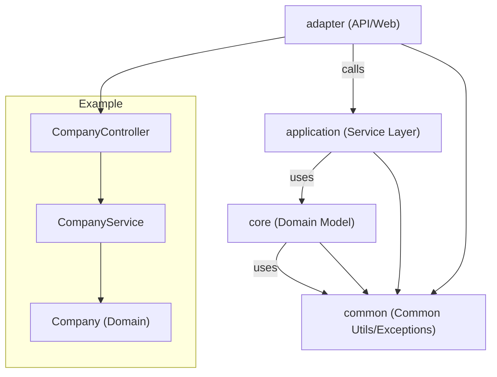

# K-Win 멀티모듈 백엔드 프로젝트

## 소개

K-Win은 Kotlin, Spring Boot, JPA, QueryDSL 기반의 멀티모듈 백엔드 프로젝트입니다. 기업(Company) 도메인 기반의 확장 가능한 구조를 갖추고 있습니다.

## 모듈 구조

- **adapter**: API/Web 계층 (Controller, REST API, Swagger 등)
- **application**: 서비스 계층 (비즈니스 로직, UseCase, Service)
- **core**: 도메인 계층 (Entity, VO, 도메인 서비스)
- **common**: 공통 유틸리티, 예외, 로깅 등

## 아키텍처



## 주요 도메인 예시 (Company)

- 기업(Company) 정보 관리 (이름, 설명, 주소, URL, 기업 유형 등)
- 기업 유형: 대기업, 중견기업, 중소기업, 외국계 기업 등
- 예외 및 검증 로직 내장

## 빌드 및 실행 방법

```bash
# 전체 빌드
./gradlew build

# adapter 모듈 실행 (API 서버)
cd adapter
./gradlew bootRun
```

## 환경 변수 및 설정

- 환경별 yml 파일: `application-dev.yml`, `application-local.yml` 등
- 예시 환경 변수:
  - `ENCRYPT_KEY=...` (dev, prod 환경)

## 확장 아이디어

- 기업 정보 CRUD, 검색, 통계, 대시보드
- 멀티테넌시 SaaS 백엔드
- 오픈 API 제공 플랫폼
- 데이터 분석/리포트 시스템

## 기여 및 문의

- PR/이슈 환영
- 문의: maintainer@example.com
